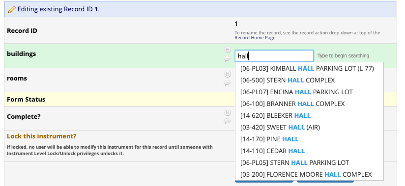
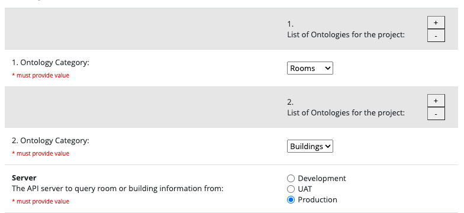
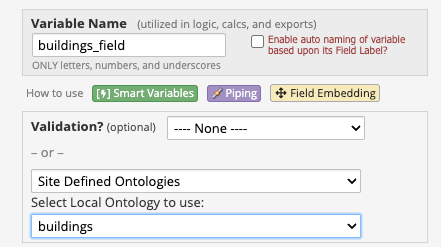
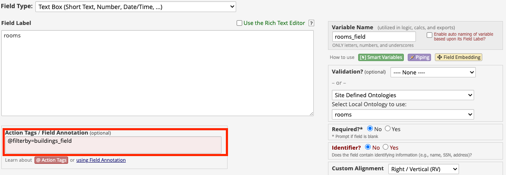

# LBRE Ontology External Module

This redcap module extends the functionality of the Simple Ontology External Module and adds the ability to query
Stanford room and building Data through the location API.





### Setup

Most of the configuration settings can be found in the system settings

Here is a list of required system settings (also seen in config.json):

```
{
    "server": "development" || "uat" || "production",
    "auth-login": <Username>
    "auth-password": <Password>
    "dev-url": <DEV API URL>
}
```

### Instrument configuration



Both Rooms and Buildings must be selected as ontology categories from the repeatable dropdown list.

Server designation will allow you to cycle between API endpoints at will.

After enabling these settings in External Modules, buildings and rooms can then be selected from instrument configuration.




Result count may also be specified in the external module settings.

### Additional functionality

Room fields can be filtered by building ID by specifying the corresponding building field:



In this example, `rooms_field` will only return results in the dropdown list if it is within the value specified in `buildings_field`.

Filtering by building ID will work in the following circumstances:
1. `buildings_field` and `rooms_field` are on the same form or survey page
2. `buildings_field` has a value saved on a different form, and is still specified in an action tag on a room field

The current implementation only allows for filtering room results by a single building ID.

Upon user search, all results will be shown without filter if `buildings_field` is empty but still specified by an action tag.
