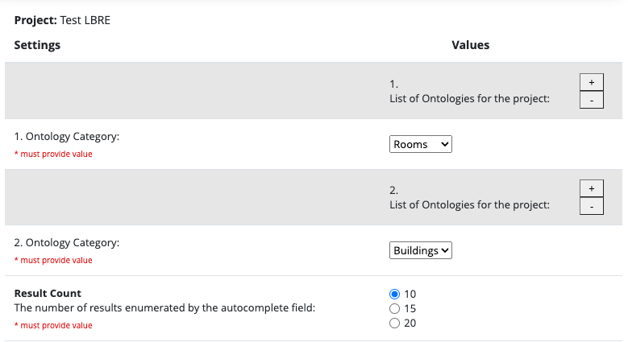

# LBRE Ontology External Module

This redcap module extends the functionality of the Simple Ontology External Module and adds the ability to query
Stanford room and building Data through the location API.


### Setup

Most of the configuration settings can be found in the system settings

Here is a list of required system settings (also seen in config.json):

```
{
    "server": "development" || "uat" || "production",
    "auth-login": <Username>
    "auth-password": <Password>
    "dev-url": <DEV API URL>
}
```

### Instrument configuration



Both Rooms and Buildings must be selected as ontology categories from the repeatable dropdown list.

Server designation will allow you to cycle between API endpoints at will.

After enabling these settings in External Modules, buildings and rooms can then be selected from instrument configuration.


### Additional functionality

Room fields can be filtered by building ID by specifying the corresponding building field:


In this example, `rooms_field` will only return results within `buildings_field` specified by the action tag.

Upon record entry, all results will be shown without filter if `buildings_field` is empty.

####Because of this, it is necessary to save the record with a selected building before this filter will function.
